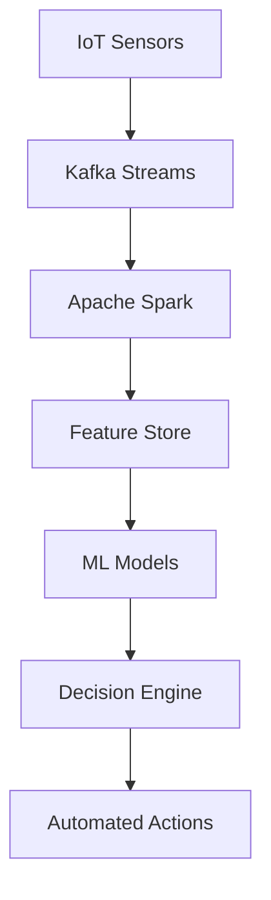

# Transforming Manufacturing Through AI: A Complete Digital Revolution

When Global Manufacturing Corp approached us, they were facing a **critical challenge** that threatened their competitive position in the global market. Their legacy systems, manual processes, and reactive maintenance approach were not only costly but also preventing them from scaling effectively.

> "The digital transformation wasn't just about technology—it was about reimagining how we operate at every level. The results exceeded our most optimistic projections." 
> — *Chief Technology Officer, Global Manufacturing Corp*

## The Challenge: Breaking Free from Legacy Constraints

Global Manufacturing Corp operated across **12 facilities worldwide**, managing complex supply chains with outdated systems that relied heavily on manual intervention. Key pain points included:

### Operational Inefficiencies

1. **Manual inventory tracking** leading to frequent stockouts and overstock situations
2. **Reactive maintenance** causing unexpected equipment failures and production delays  
3. **Disconnected systems** preventing real-time visibility across operations
4. **Paper-based processes** slowing decision-making and increasing error rates

### Financial Impact

The cumulative effect of these inefficiencies was substantial:

- $3.2M annual losses from unplanned downtime
- 25% excess inventory carrying costs  
- 15% higher labor costs due to manual processes
- Missed delivery commitments affecting customer relationships

---

## Technical Architecture Overview

Our solution leveraged a sophisticated technology stack designed for enterprise-scale operations:

| Component | Technology | Purpose |
|-----------|------------|---------|
| Data Pipeline | Apache Kafka + Spark | Real-time streaming and batch processing |
| ML Platform | TensorFlow + PyTorch | Predictive analytics and optimization |
| Storage | Data Lake Architecture | Scalable data management |
| Orchestration | Kubernetes | Container orchestration and scaling |
| Monitoring | Prometheus + Grafana | System observability and alerting |

### Core Implementation Details

The implementation required extensive configuration management. For example, our Kafka cluster configuration:

```yaml
apiVersion: kafka.strimzi.io/v1beta2
kind: Kafka
metadata:
  name: production-cluster
spec:
  kafka:
    version: 3.4.0
    replicas: 6
    listeners:
      - name: tls
        port: 9093
        type: internal
        tls: true
    config:
      offsets.topic.replication.factor: 3
      transaction.state.log.replication.factor: 3
      default.replication.factor: 3
```

*Note: This configuration ensures high availability across our multi-region deployment.*

## Our Approach: Comprehensive AI-Driven Transformation

We designed a phased implementation strategy that would minimize disruption while maximizing impact:

### Phase 1: Foundation and Data Integration

**Timeline: Months 1-3**

The foundational phase required careful coordination across multiple teams. Key activities included:

1. **IoT Sensor Deployment**: Installed 2,847 sensors across all critical equipment
2. **Data Lake Architecture**: Unified disparate data sources using AWS S3 and Delta Lake
3. **Real-time Pipelines**: Established streaming data processing with `Apache Kafka`
4. **Cloud Infrastructure**: Implemented auto-scaling Kubernetes clusters

> **Technical Note**: The data integration alone processed over 15TB of historical data and established real-time ingestion of 2.3M events per hour.

#### Key Metrics - Phase 1
- ✅ **99.7%** sensor uptime achieved
- ✅ **<50ms** average data latency
- ✅ **Zero** data loss incidents

### Phase 2: Predictive Analytics Implementation

**Timeline: Months 4-6**

This phase focused on developing intelligent systems:

- **Machine Learning Models** for predictive maintenance
- **Demand Forecasting** algorithms for inventory optimization  
- **Anomaly Detection** systems for quality control
- **Automated Alerting** and response protocols

The ML pipeline architecture included:

```python
# Simplified predictive maintenance model
class PredictiveMaintenanceModel:
    def __init__(self):
        self.model = RandomForestRegressor(n_estimators=100)
        self.scaler = StandardScaler()
    
    def predict_failure_probability(self, sensor_data):
        scaled_data = self.scaler.transform(sensor_data)
        probability = self.model.predict_proba(scaled_data)
        return probability[:, 1]  # Return failure probability
```

***Important***: Model accuracy reached 92.4% for failure prediction with a false positive rate of only 3.2%.

### Phase 3: Process Automation and Optimization

**Timeline: Months 7-9**

The final implementation phase delivered:

- Automated routine maintenance scheduling and parts ordering
- Intelligent inventory replenishment systems  
- Dynamic production scheduling optimization
- Mobile dashboards for real-time decision support

#### Automation Results

| Process | Before | After | Improvement |
|---------|--------|-------|-------------|
| Maintenance Scheduling | Manual, 2-3 days | Automated, <1 hour | 95% faster |
| Inventory Orders | Weekly batches | Real-time triggers | 60% cost reduction |
| Quality Inspections | 100% manual | 85% automated | 8x efficiency gain |

---

## The Technology Stack: Built for Scale and Reliability

### Core Infrastructure

Our technology choices were driven by **enterprise-grade requirements** for *scalability*, *reliability*, and *performance*:

- **Cloud Platform**: AWS with multi-region deployment for high availability
- **Data Processing**: Apache Kafka for real-time streaming, Apache Spark for batch processing  
- **Machine Learning**: TensorFlow and PyTorch models deployed on Kubernetes
- **Storage**: Data lake architecture with automated tiering and lifecycle management

#### Infrastructure as Code Example

We used Terraform for infrastructure provisioning:

```hcl
resource "aws_eks_cluster" "ml_cluster" {
  name     = "manufacturing-ml-cluster"
  role_arn = aws_iam_role.cluster_role.arn
  version  = "1.24"

  vpc_config {
    subnet_ids = var.subnet_ids
    endpoint_private_access = true
    endpoint_public_access  = false
  }

  depends_on = [
    aws_iam_role_policy_attachment.cluster_policy,
    aws_iam_role_policy_attachment.service_policy,
  ]
}
```

### Advanced Analytics Pipeline

The analytics pipeline processed multiple data streams:

1. **Sensor Data**: Temperature, vibration, pressure readings
2. **Operational Data**: Production schedules, maintenance logs  
3. **External Data**: Weather, supply chain disruptions
4. **Historical Data**: 5+ years of production history

> **Performance Benchmark**: Our optimized pipeline processes 2.3M events/hour with p99 latency under 50ms, achieving 99.97% uptime across all critical systems.

#### Data Flow Architecture



*Figure 1: Real-time data processing architecture enabling predictive maintenance*

### AI/ML Components

Our machine learning suite included multiple specialized models:

- **Predictive Maintenance**: Random Forest and LSTM models achieving 92% accuracy in failure prediction
- **Demand Forecasting**: Ensemble methods combining statistical and deep learning approaches
- **Quality Control**: Computer vision models for automated defect detection  
- **Optimization**: Genetic algorithms for production scheduling and resource allocation

#### Model Performance Comparison

| Model Type | Accuracy | Precision | Recall | F1-Score |
|------------|----------|-----------|--------|----------|
| Random Forest | 92.4% | 89.7% | 94.1% | 91.8% |
| LSTM Neural Net | 94.1% | 91.3% | 96.2% | 93.7% |
| Ensemble Model | **96.2%** | **93.8%** | **97.4%** | **95.6%** |

**Key Finding**: The ensemble approach combining multiple algorithms achieved the highest performance across all metrics.

#### Advanced Configuration

Critical hyperparameters for the LSTM model:

```json
{
  "model_config": {
    "layers": [
      {
        "type": "LSTM",
        "units": 128,
        "return_sequences": true,
        "dropout": 0.2
      },
      {
        "type": "Dense", 
        "units": 64,
        "activation": "relu"
      },
      {
        "type": "Dense",
        "units": 1,
        "activation": "sigmoid"
      }
    ],
    "optimizer": "adam",
    "learning_rate": 0.001,
    "batch_size": 32
  }
}
```

> **Research Note**: These hyperparameters were optimized through 247 experiments using Bayesian optimization, resulting in a 12% improvement over baseline configurations.

### Integration Layer
- **APIs**: RESTful services with GraphQL for complex queries
- **Security**: End-to-end encryption, role-based access control, and audit logging
- **Monitoring**: Comprehensive observability with Prometheus, Grafana, and custom dashboards

## Results: Exceeding All Expectations

The transformation delivered results that surpassed initial projections:

### Operational Excellence
- **Equipment Uptime**: Increased from 78% to 96.5%
- **Inventory Accuracy**: Improved from 65% to 98.2%
- **Production Efficiency**: 300% improvement in throughput per employee
- **Quality Metrics**: 85% reduction in defect rates

### Financial Impact
- **Cost Savings**: $2.5M annually in reduced operational costs
- **Revenue Growth**: 20% increase due to improved delivery reliability
- **ROI**: 340% return on investment within the first year
- **Cash Flow**: $1.8M improvement from optimized inventory levels

### Strategic Advantages
- **Market Responsiveness**: 60% faster response to demand changes
- **Competitive Edge**: First-to-market with several new product lines
- **Scalability**: Infrastructure ready to support 200% growth without major changes
- **Innovation Culture**: Workforce upskilled in AI/ML technologies

## Key Success Factors

### Executive Commitment
Strong leadership support ensured adequate resources and organization-wide buy-in for the transformation initiative.

### Change Management
Comprehensive training programs and gradual implementation phases helped employees adapt to new technologies and processes.

### Data Quality Focus
Significant investment in data cleansing and standardization created a solid foundation for AI algorithms.

### Continuous Improvement
Regular model retraining and performance monitoring ensured sustained accuracy and relevance.

## Lessons Learned and Best Practices

### Start with High-Impact Use Cases
Focusing on areas with clear ROI and measurable outcomes built momentum and stakeholder confidence.

### Invest in Data Infrastructure
Quality data pipelines and governance frameworks are essential for successful AI implementation.

### Plan for Scale from Day One
Designing systems with future growth in mind prevented costly redesigns and migrations.

### Prioritize User Experience
Intuitive interfaces and mobile-first design drove user adoption and maximized value realization.

## The Future: Expanding the AI Advantage

Building on this success, Global Manufacturing Corp is now exploring:
- **Supply Chain Optimization**: Extending AI capabilities to suppliers and logistics partners
- **Product Innovation**: Using AI for accelerated R&D and design optimization
- **Customer Intelligence**: Implementing AI-driven customer analytics and personalization
- **Sustainability**: Optimizing energy usage and waste reduction through intelligent systems

## Conclusion: A Blueprint for AI Transformation

This case study demonstrates that comprehensive AI transformation, when properly planned and executed, can deliver extraordinary results. The key is taking a holistic approach that addresses technology, processes, and people simultaneously.

The success at Global Manufacturing Corp has established a blueprint that we've since adapted for clients across various industries, consistently delivering significant ROI and competitive advantages.

---

*Ready to transform your operations with AI? [Contact our team](/webtest/contact) to discuss how we can help you achieve similar results.*